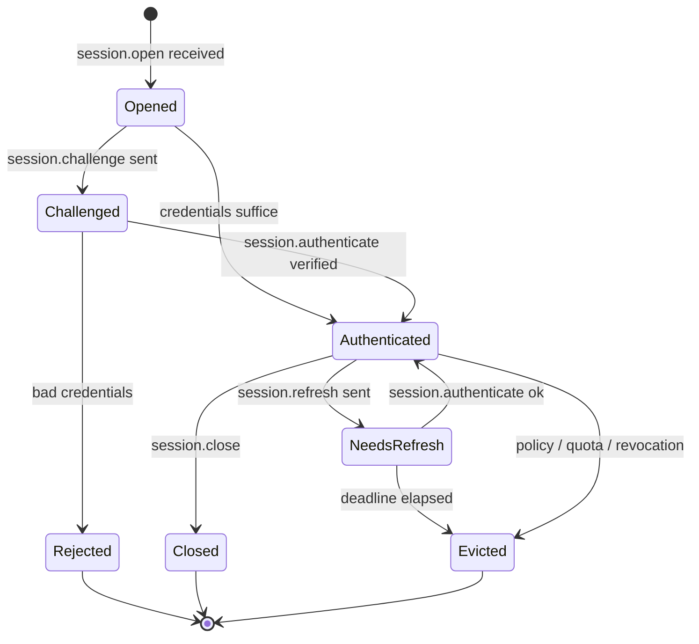
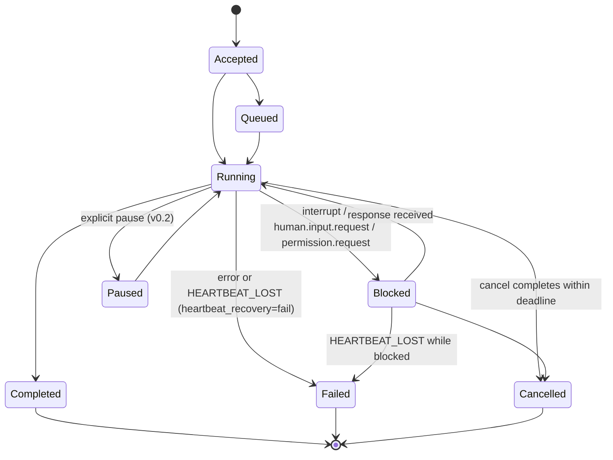
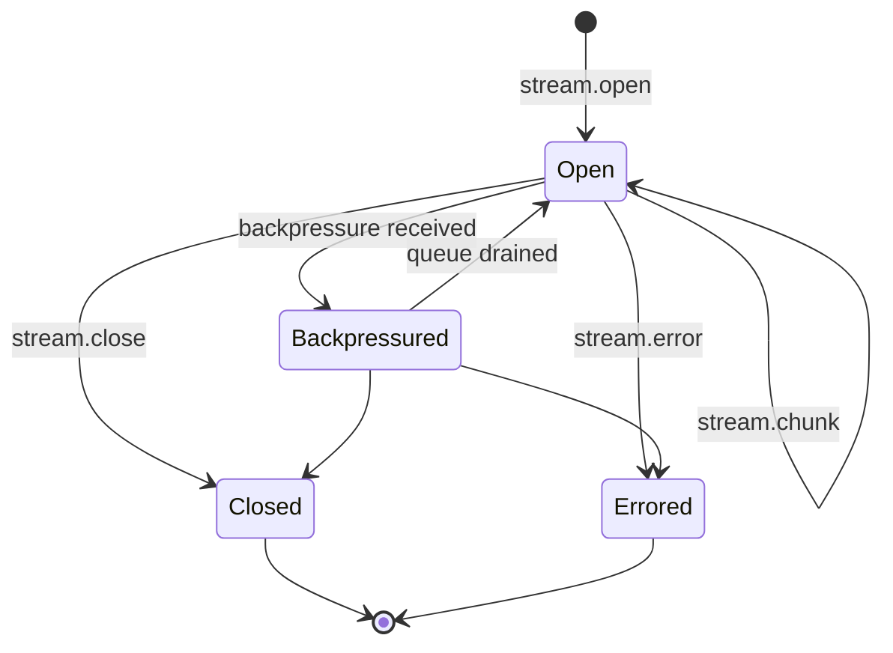
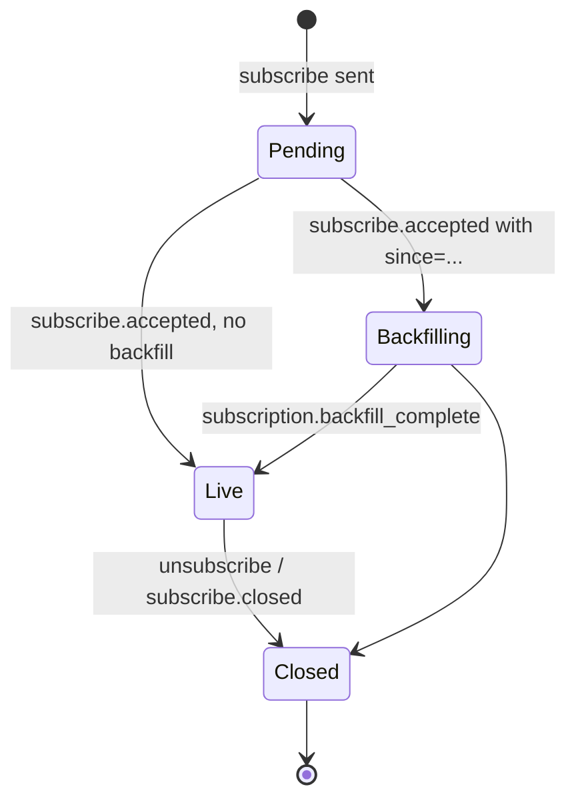
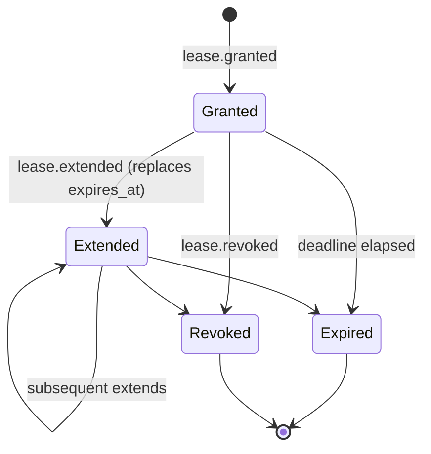

# `arcp` (Java) — Build Plan

This is the engineering plan for the Java reference implementation of ARCP
v1.0. It is the authoritative companion to [RFC-0001-v2.md](RFC-0001-v2.md)
(canonical) and [CONFORMANCE.md](CONFORMANCE.md) (per-section status). It is
updated at every phase gate.

The plan deliberately leans into modern Java (records, sealed interfaces,
pattern matching for switch, virtual threads, structured concurrency,
`ScopedValue`) and avoids classical-Java ceremony. Where the RFC is silent,
the chosen interpretation is documented in §A4 and stamped at the
implementation site as `// RFC §X.Y choice:` so a future reader can find and
challenge it.

---

## A1. RFC section walk-through

Every protocol-affecting section is summarised below. Sentences that
constrain implementation are flagged with **[impl]**.

**§1 Goals.** ARCP is transport-independent, streaming-first, durable,
authenticated, observable execution. **[impl]** sets the breadth bar: every
piece we ship maps onto one of the named goals.

**§2 Non-Goals.** Excludes prompt formats, vector stores, model schemas, tool
schemas, UI, IdP implementations, persistence engines. **[impl]** the library
exposes protocol exchange shapes only — the user wires their own credential
store, artifact backend, and tool implementations.

**§3 Terminology.** Defines Agent, Runtime, Tool, Session, Stream, Job,
Capability, Envelope, Transport, Lease, Subscription, Artifact, Identity,
Heartbeat, Extension, Observer. Used verbatim as Java class and package names
(`Session`, `Job`, `Stream`, `Lease`, `Artifact`, `Subscription`,
`Envelope`, `Capability`, `Identity`, `Observer`).

**§4 Design Principles.** Transport-agnostic (§4.1), streaming-native (§4.2),
durable (§4.3), typed contracts (§4.4), event-driven (§4.5), authenticated
by default (§4.6), extensible (§4.7). **[impl]** §4.6 is enforced at the
runtime layer: the dispatcher rejects every non-handshake message until the
session reaches `Authenticated`. We considered a sealed type-state for
`Session` (`Session<Unauthenticated>` not exposing `invoke`) but settled on
a runtime-checked state field for v0.1 because Java type-state via sealed
classes adds a lot of generic friction without the upside Rust gets from
compile-time enforcement of trait bounds. Documented in §A4.

**§5 Architecture.** Three layers (capability/runtime/transport) and three
client roles (active, observer, peer runtime). **[impl]** observers carry
only subscriptions; surfaced as a separate `ARCPClient.observer(...)` factory
that returns a client without `invoke` semantics.

**§6.1 Envelope.** 18 fields, payload is type-specific. **[impl]** envelope
is a record `Envelope` holding metadata; payload is a sealed interface
`MessageType` with one record per variant. Jackson dispatches on the wire
`type` discriminator via `@JsonTypeInfo` + `@JsonSubTypes`. `id` is the
transport idempotency key; `idempotency_key` is the logical intent key
(§6.4).

**§6.2 Message Types.** Enumerates every type in scope. The plan tabulates
them exhaustively in §A2 below. The compiler enforces that every dispatcher
covers every variant via switch-with-pattern-matching on the sealed
interface.

**§6.3 Command/Result/Event Flow.** Commands MAY produce a chain of
`ack`/`job.accepted`, `job.started`, `job.progress`/`job.heartbeat`/`log`/
`metric`/`job.checkpoint`, terminating in exactly one terminal event per the
command kind. **[impl]** the runtime enforces the terminal-event invariant
in `runtime/JobManager.java` — emitting a second terminal envelope for the
same `job_id` throws `IllegalStateException` (caller bug) which is caught
and surfaces as an `INTERNAL` error envelope.

**§6.4 Delivery Semantics.** At-least-once for durable jobs; receivers MUST
deduplicate by `id`; `idempotency_key` keyed off `(session_principal,
idempotency_key)` is preserved at least until the lease horizon. Ordering is
guaranteed only within a `stream_id` or `job_id`. **[impl]** dedup is a
UNIQUE constraint on `(session_id, id)` in the SQLite event log; logical
dedup is a separate index `(session_principal, idempotency_key)`.

**§6.5 Priority and QoS.** `low | normal | high | critical`; default
`normal`. **[impl]** ordering within `stream_id`/`job_id` MUST NOT be
reordered by priority — guaranteed by the per-stream `LinkedBlockingQueue`
being FIFO. Inter-stream scheduling under load uses a simple priority
multiplexer in `runtime/StreamManager`; v0.1 is FIFO with priority used only
for the shedding decision (§6.5 second bullet).

**§7 Capability Negotiation.** Booleans default to `false`;
required-but-unsupported responds `session.rejected` with
`code: UNIMPLEMENTED`. **[impl]** `Capabilities` is a record with `Boolean`
(boxed) fields; missing means false at read time, omitted on serialise via
`@JsonInclude(NON_NULL)`. Unknown capabilities go into a
`Map<String, JsonNode> extras` and are preserved verbatim for round-trip.

**§8.1 Handshake.** Four-message handshake; non-handshake messages received
pre-acceptance MUST be dropped and logged. **[impl]** `Session` keeps a
`State` enum (`Opened`, `Challenged`, `Authenticated`, `Closed`) and the
dispatcher rejects-with-log every non-handshake type while the state is not
`Authenticated`.

**§8.2 Credentials.** Five schemes — `bearer`, `mtls`, `oauth2`,
`signed_jwt`, `none`. v0.1 ships `bearer`, `signed_jwt`, `none`. The auth
scheme types form a sealed interface `AuthScheme` with permitted records
`BearerAuth`, `JwtAuth`, `NoneAuth`; `Mtls` and `OAuth2` are present as
sealed alternatives that throw `UnimplementedException` if invoked.

**§8.3 Runtime Identity.** Runtime emits its identity in `session.accepted`
with `kind`, `version`, `fingerprint`, `trust_level`. **[impl]** library
exposes `Version.IMPL_KIND = "arcp-java"` and `Version.IMPL_VERSION` from
`gradle.properties` baked at build time via a generated class.

**§8.4 Re-authentication.** `session.refresh` requires fresh authenticate
before deadline; failure emits `session.evicted`.

**§8.5 Eviction.** `session.evicted` carries a reason from §18 taxonomy.

**§9 Sessions.** Stateless / stateful / durable. v0.1: stateless and
stateful. Durable across reconnect (resume) is intentionally minimal —
message-id-only resume per §19; checkpoint resume is v0.2.

**§10.1–§10.2 Jobs / States.** 8 states: `accepted`, `queued`, `running`,
`blocked`, `paused`, `completed`, `failed`, `cancelled`. Exactly one
terminal per job. **[impl]** state is a `JobState` enum;
`Job.transition(JobEvent)` returns either the new state or throws
`FailedPreconditionException`. Terminal states are sealed: any transition
from `Completed`/`Failed`/`Cancelled` is `FAILED_PRECONDITION`.

**§10.3 Heartbeats.** `heartbeat_interval_seconds` default 30; default
`N=2` consecutive missed deadlines transitions to `failed` with
`HEARTBEAT_LOST` or to `blocked` based on `heartbeat_recovery: "fail" |
"block"`. **[impl]** watchdog driven by an injectable `Clock` and a
`ScheduledExecutorService` over virtual threads; tests use a `MutableClock`
to step time deterministically (Awaitility around the resulting state
transition).

**§10.4 Cancellation.** Cooperative; `cancel.accepted` then terminal within
deadline; escalation to hard kill emits `ABORTED`. **[impl]**
`Cancellation` wraps a `CompletableFuture<Void>` plus an `AtomicBoolean`;
hard-kill interrupts the virtual thread inside the
`StructuredTaskScope.shutdown()` boundary.

**§10.5 Interrupts.** Distinct from cancel: target → `blocked`, emit
`human.input.request`, resume on response or explicit cancel. Runtimes that
cannot honor MUST advertise `capabilities.interrupt: false`.

**§10.6 Scheduled Jobs.** v0.2. Stub returns `nack` with `UNIMPLEMENTED`
and the runtime advertises `capabilities.scheduled_jobs: false`.

**§11.1 Stream Kinds.** `text`, `binary`, `event`, `log`, `metric`,
`thought`. Unknown → `event`. **[impl]** `StreamKind` enum plus an
`unknown(String)` factory that maps to `EVENT` for routing while preserving
the original string for round-trip.

**§11.2 Backpressure.** `backpressure` carries desired rate / buffer /
reason. **[impl]** producer side uses a bounded `LinkedBlockingQueue`; on
`put()` blocking past a threshold the runtime emits a `backpressure`
envelope with `reason: "producer_blocked"`. `desired_rate_per_second` is
chunks/second (see §A4).

**§11.3 Binary Encoding.** v0.1 = base64 in-envelope only. Capability
advertised as `["base64"]`. Sidecar frames are v0.2.

**§11.4 Reasoning Streams.** `kind: thought` chunks with `role`, `content`,
`redacted`. Subscribers MAY filter.

**§12.1–§12.2 Human Input / Choice.** Request carries `prompt`,
`response_schema` (input only), optional `default`, `expires_at`. Response
carries the value plus provenance.

**§12.3 Provenance.** Default first-response-wins; v0.1 implements only the
default. Stale prompts cleared via `human.input.cancelled`.

**§12.4 Expiration.** `default` set → synthesise response with
`responded_by: "default"`. Otherwise emit `human.input.cancelled` with
`DEADLINE_EXCEEDED`.

**§13.1–§13.4 Subscriptions.** Filters AND across fields, OR within array.
Backfill ends with synthetic `subscription.backfill_complete`. Either side
can `unsubscribe`; runtime can `subscribe.closed`.

**§14 Multi-Agent Coordination.** v0.2 — stubs throw
`UnimplementedException("§14", "...")`.

**§15 Permissions, Sandboxing, Trust Levels, Leases.** Permission challenge
→ grant materialises `lease.granted`; leases can be refreshed/extended/
revoked; operations against expired or revoked leases return
`PERMISSION_DENIED` with `LEASE_EXPIRED` / `LEASE_REVOKED`. **[impl]**
`Sandboxing` (§15.2) is a runtime concern, not a protocol surface; we
expose hooks but ship no actual sandbox. Trust elevation (§15.6) is v0.2.

**§16 Artifacts.** Inline base64 in v0.1. `artifact.put/fetch/ref/release`.
Retention sweep on a daemon virtual thread driven by
`ScheduledExecutorService`; expired → `NOT_FOUND`.

**§17 Observability.** `trace_id`/`span_id` carried everywhere; SLF4J MDC
populated via a `Tracing` helper backed by `ScopedValue<TraceContext>`.
Standard metric names (`tokens.used`, `cost.usd`, `gpu.seconds`,
`tool.invocations`, `latency.ms`, `bytes.in`, `bytes.out`, `errors.total`)
exposed as `public static final String` constants in
`messages.telemetry.StandardMetrics` so users avoid string typos.

**§18 Errors.** Canonical codes as a Java `enum ErrorCode`; `ARCPException`
(extends `RuntimeException`) is the single source of truth, with one
subclass per code that carries typed context.

**§19 Resumability.** v0.1: `after_message_id` only. Retention expiry →
emit `DATA_LOSS`.

**§20 MCP Compatibility.** Advisory; nothing to implement directly.

**§21 Extensions.** Namespacing rules enforced at `ExtensionRegistry`.
Unknown messages: `nack` with `UNIMPLEMENTED` unless
`extensions.optional: true` for namespaced types.

**§22 Reference Transports.** WebSocket and stdio mandatory, both shipped.

**§23 Example Lifecycle.** Non-normative; drives the
`RelayScenarioTest` end-to-end test.

**§24 Example Invocation.** Non-normative; canonical envelopes from the
RFC become Jackson round-trip golden tests in Phase 1
(`lib/src/test/resources/golden/*.json`).

**§25 Real-World Examples.** Non-normative; the `examples/` programs match
the named scenarios.

**§26 Future Work / §27 Why ARCP / §28 Motto.** Non-normative.

---

## A2. Message-type → record map

Every in-scope envelope `type`, the package that owns it, and the Java
record that represents the payload. Records implement the sealed interface
`dev.fizzpop.arcp.envelope.MessageType`. Jackson polymorphism is declared on
that interface via `@JsonTypeInfo(property = "type")` plus `@JsonSubTypes`.

### Identity & authentication — `messages.session`

| Wire type                  | Record class                  |
| -------------------------- | ----------------------------- |
| `session.open`             | `SessionOpen`                 |
| `session.challenge`        | `SessionChallenge`            |
| `session.authenticate`     | `SessionAuthenticate`         |
| `session.accepted`         | `SessionAccepted`             |
| `session.unauthenticated`  | `SessionUnauthenticated`      |
| `session.rejected`         | `SessionRejected`             |
| `session.refresh`          | `SessionRefresh`              |
| `session.evicted`          | `SessionEvicted`              |
| `session.close`            | `SessionClose`                |

### Control — `messages.control`

| Wire type            | Record class                     |
| -------------------- | -------------------------------- |
| `ping`               | `Ping`                           |
| `pong`               | `Pong`                           |
| `ack`                | `Ack`                            |
| `nack`               | `Nack`                           |
| `cancel`             | `Cancel`                         |
| `cancel.accepted`    | `CancelAccepted`                 |
| `cancel.refused`     | `CancelRefused`                  |
| `interrupt`          | `Interrupt`                      |
| `resume`             | `Resume`                         |
| `backpressure`       | `Backpressure`                   |
| `checkpoint.create`  | `CheckpointCreate` *(v0.2 stub)* |
| `checkpoint.restore` | `CheckpointRestore` *(v0.2 stub)*|

### Execution — `messages.execution`

| Wire type           | Record class                  |
| ------------------- | ----------------------------- |
| `tool.invoke`       | `ToolInvoke`                  |
| `tool.result`       | `ToolResult`                  |
| `tool.error`        | `ToolError`                   |
| `job.accepted`      | `JobAccepted`                 |
| `job.started`       | `JobStarted`                  |
| `job.progress`      | `JobProgress`                 |
| `job.heartbeat`     | `JobHeartbeat`                |
| `job.checkpoint`    | `JobCheckpoint` *(v0.2 stub)* |
| `job.completed`     | `JobCompleted`                |
| `job.failed`        | `JobFailed`                   |
| `job.cancelled`     | `JobCancelled`                |
| `job.schedule`      | `JobSchedule` *(stub)*        |
| `workflow.start`    | `WorkflowStart` *(stub)*      |
| `workflow.complete` | `WorkflowComplete` *(stub)*   |
| `agent.delegate`    | `AgentDelegate` *(stub)*      |
| `agent.handoff`     | `AgentHandoff` *(stub)*       |

### Streaming — `messages.streaming`

| Wire type      | Record class  |
| -------------- | ------------- |
| `stream.open`  | `StreamOpen`  |
| `stream.chunk` | `StreamChunk` |
| `stream.close` | `StreamClose` |
| `stream.error` | `StreamError` |

### Human-in-the-Loop — `messages.human`

| Wire type                 | Record class           |
| ------------------------- | ---------------------- |
| `human.input.request`     | `HumanInputRequest`    |
| `human.input.response`    | `HumanInputResponse`   |
| `human.choice.request`    | `HumanChoiceRequest`   |
| `human.choice.response`   | `HumanChoiceResponse`  |
| `human.input.cancelled`   | `HumanInputCancelled`  |

### Permissions & Leases — `messages.permissions`

| Wire type            | Record class        |
| -------------------- | ------------------- |
| `permission.request` | `PermissionRequest` |
| `permission.grant`   | `PermissionGrant`   |
| `permission.deny`    | `PermissionDeny`    |
| `lease.granted`      | `LeaseGranted`      |
| `lease.extended`     | `LeaseExtended`     |
| `lease.revoked`      | `LeaseRevoked`      |
| `lease.refresh`      | `LeaseRefresh`      |

### Subscriptions — `messages.subscriptions`

| Wire type            | Record class        |
| -------------------- | ------------------- |
| `subscribe`          | `Subscribe`         |
| `subscribe.accepted` | `SubscribeAccepted` |
| `subscribe.event`    | `SubscribeEvent`    |
| `unsubscribe`        | `Unsubscribe`       |
| `subscribe.closed`   | `SubscribeClosed`   |

### Artifacts — `messages.artifacts`

| Wire type          | Record class      |
| ------------------ | ----------------- |
| `artifact.put`     | `ArtifactPut`     |
| `artifact.fetch`   | `ArtifactFetch`   |
| `artifact.ref`     | `ArtifactRef`     |
| `artifact.release` | `ArtifactRelease` |

### Telemetry — `messages.telemetry`

| Wire type    | Record class |
| ------------ | ------------ |
| `event.emit` | `EventEmit`  |
| `log`        | `Log`        |
| `metric`     | `Metric`     |
| `trace.span` | `TraceSpan`  |

The synthetic `subscription.backfill_complete` payload (carried inside an
`event.emit`) is exposed as a `public static final String` constant in
`messages.subscriptions.SyntheticEvents`.

---

## A3. State machines

Five state machines drive the runtime. The diagrams below are the source of
truth for the corresponding Java types' transition methods. Each state
machine lives under `runtime/` and is encoded as an `enum` plus a
`transition` method that returns `NewState` or throws an `ARCPException`
subclass with the appropriate canonical code (typically
`FAILED_PRECONDITION`).

### A3.1 Session



The `Session` class keeps a `volatile` `SessionState` field (no shared
mutable substate beyond the single enum) and gates dispatch on it.

### A3.2 Job



`JobState` is an enum; `Job.transition(JobEvent)` enforces legality.
Terminal states are sealed: any transition out of `Completed`/`Failed`/
`Cancelled` throws `FailedPreconditionException`.

### A3.3 Stream



`StreamWriter` owns the producer side; `StreamReader` (a
`Flow.Publisher<StreamChunk>`) the consumer side. Backpressure surfaces
implicitly through the bounded queue's `put()` blocking; the
`Backpressured` state is observable for telemetry via a watcher latch.

### A3.4 Subscription



Backfill is a `Flow.Publisher` chained with a live tail
`SubmissionPublisher` from `java.util.concurrent`. The synthetic boundary
marker is emitted by the runtime, not the store.

### A3.5 Lease



`LeaseManager` keeps a `ConcurrentHashMap<LeaseId, Lease>` and a per-lease
`ScheduledFuture` for expiry. Cancellation by `lease.revoked` cancels the
future and sets the lease state; subsequent operations referencing the
lease throw `LeaseExpiredException` or `LeaseRevokedException`.

---

## A4. Open questions and chosen interpretations

The RFC is mostly explicit, but a few corners need a deliberate call. Each
item carries the section reference, the gap, and v0.1's choice. Each
decision appears in code as a `// RFC §X.Y choice:` comment at the
implementation site.

1. **§4.6 type-state vs. runtime check.** Rust uses type-state for the
   handshake gate. **Choice:** Java v0.1 uses a runtime-checked
   `SessionState` enum on `Session`. Type-state via sealed-with-permits is
   feasible but propagates generics through every API surface; the
   compile-time win is small relative to the readability cost in Java. We
   write a single dispatcher invariant test and trust it.

2. **§6.1 `arcp` field type.** Format unspecified. **Choice:** dotted
   `MAJOR.MINOR` string; v0.1 always emits `"1.0"`; on receive we accept any
   string and defer compatibility checks to capability negotiation.

3. **§6.4 `id` format.** RFC examples use `msg_01JABC` (looks ULID-like) but
   no format is mandated. **Choice:** all newtype IDs are
   `<prefix>_<ULID>` where prefix is one of `msg_`, `sess_`, `job_`, `str_`,
   `sub_`, `art_`, `lease_`, `trace_`, `span_`. Prefix asserted on
   `of(String)`; compact-constructor rejects malformed IDs with
   `IllegalArgumentException`.

4. **§6.4 logical idempotency horizon.** "At least the lease horizon"
   leaves the actual TTL unspecified. **Choice:** v0.1 retains
   `(session_principal, idempotency_key) -> message_id` rows in the event
   log for 24 hours; sweep is done by the same scheduled task that handles
   artifact retention.

5. **§7 capability defaults.** RFC says absent booleans are false but does
   not enumerate every capability. **Choice:** the `Capabilities` record
   covers exactly the booleans named in §7 plus `heartbeat_recovery`,
   `binary_encoding`, `anonymous`, `interrupt`, `extensions`. Unknown
   capabilities advertised by the peer are preserved in
   `Map<String, JsonNode> extras` and ignored by the runtime.

6. **§8.2 `client.fingerprint` for `mtls`.** RFC requires fingerprint be
   present. v0.1 doesn't ship `mtls`, so this is moot until v0.2.

7. **§10.3 heartbeat `deadline_ms`.** Per-heartbeat deadline is
   informational in the example; the RFC's hard deadline is the negotiated
   interval. **Choice:** we honor `max(negotiated_interval,
   deadline_ms)` when scheduling the watchdog reset.

8. **§10.4 cancellation deadline default.** Unspecified. **Choice:** if
   `deadline_ms` is omitted, default to 5_000 ms.

9. **§11.2 `backpressure.desired_rate_per_second`.** Unit ambiguity
   (chunks vs. bytes). **Choice:** chunks per second. Bytes would make the
   field redundant with `buffer_remaining_bytes`.

10. **§12.1 `response_schema` validator.** RFC declines to mandate a
    dialect. **Choice:** JSON Schema draft 2020-12, validated via
    `com.networknt:json-schema-validator` (justified in §A6).

11. **§13.2 filter authorization.** RFC says runtimes MUST reject
    unauthorized filters with `PERMISSION_DENIED` but does not say what
    counts as authorization. **Choice:** v0.1 authorizes a subscription if
    any of `session_id`/`trace_id`/`job_id`/`stream_id` listed in the
    filter is owned by the subscribing session's principal. Filters that
    omit all four are accepted only if the principal carries a synthetic
    `subscriptions.global` permission lease.

12. **§16.2 inline `artifact.put` size cap.** Unspecified. **Choice:**
    4 MiB after base64 decode in v0.1; oversized → `INVALID_ARGUMENT`.

13. **§16.3 retention sweep cadence.** Unspecified. **Choice:** sweep every
    60 s; configurable via `ARCPRuntime.Builder.retentionSweepInterval`.

14. **§19 retention window for replay.** Unspecified. **Choice:** 7 days;
    the same sweep that handles artifact + idempotency GC also drops events
    older than this.

15. **§21.3 unknown-message handling for stream chunks.** Stream chunks
    addressed to unknown stream ids. **Choice:** reply once with `nack`
    (`NOT_FOUND`) per `stream_id`, then drop further chunks for the same id
    silently for 60 s to avoid amplification.

16. **CLI default port.** §22 doesn't standardise. **Choice:** WebSocket
    binds to `127.0.0.1:7777` by default; documented in `--help`.

---

## A5. Test plan

Integration tests live under `lib/src/test/java/dev/fizzpop/arcp/integration/`
and `.../e2e/`. Each test parameterises over the in-memory transport at
minimum, and (after Phase 6) also WebSocket and stdio via a JUnit
`@ParameterizedTest` driven by a `@MethodSource("transports")` that yields
the three transport factories.

| Test class                  | Phase | RFC surface       | Scenario |
| --------------------------- | ----- | ----------------- | -------- |
| `EnvelopeRoundTripTest`     | 1     | §6.1              | Every variant round-trips bytewise via Jackson; canonical envelopes from §24 are golden-file asserted. |
| `EventLogTest`              | 1     | §6.4              | Dedup by `(session_id, id)`; replay ordering by ULID; index-backed lookups by `correlation_id`/`trace_id`. |
| `ExtensionUnknownTest`      | 1, 5  | §21.3             | Core type unknown → `nack` `UNIMPLEMENTED`; namespaced + `extensions.optional=true` → silent drop; namespaced + non-optional → `nack` `UNIMPLEMENTED`. |
| `HandshakeTest`             | 2     | §7, §8.1, §8.2    | Happy path; bad token → `session.rejected`; required-but-unsupported capability → `UNIMPLEMENTED`; anonymous accepted only when negotiated; pre-acceptance command dropped + logged; replayed `id` rejected. |
| `JobLifecycleTest`          | 3     | §10.1–§10.3, §6.3 | Accepted → running → completed; failure path with retryable code; heartbeat watchdog under injected `MutableClock`; `heartbeat_recovery=block` honored; `heartbeat_recovery=fail` emits `HEARTBEAT_LOST`. |
| `CancellationTest`          | 3     | §10.4             | `cancel.accepted` path; `cancel.refused` for terminal-state job; deadline elapsed → hard kill with `ABORTED`. |
| `InterruptTest`             | 3     | §10.5             | Interrupt → blocked → `human.input.request` → response → resume. |
| `HumanInputTest`            | 4     | §12.1–§12.4       | Input round-trip with schema validation; choice round-trip; expiration with `default` synthesised; expiration without default → `DEADLINE_EXCEEDED`. |
| `PermissionLeaseTest`       | 4     | §15.4–§15.5       | Permission challenge → grant → lease materialised → operation succeeds; lease expiry → `LEASE_EXPIRED`; lease revocation → `LEASE_REVOKED`. |
| `SubscriptionTest`          | 5     | §13.1–§13.4       | Filter combinations (AND across, OR within); backfill ordering; backfill→live boundary marker; subscription dropped on auth expiry; unauthorized filter → `PERMISSION_DENIED`. |
| `ArtifactTest`              | 5     | §16               | `put` (inline) → `fetch` round-trip; `ref` round-trip; `release` GC; retention sweep expiry → `NOT_FOUND`; oversized inline put → `INVALID_ARGUMENT`. |
| `ResumeTest`                | 5     | §19               | Resume across forced disconnect with no message gap (subprocess kill via `ProcessBuilder.destroyForcibly`); resume past retention horizon → `DATA_LOSS`. |
| `RelayScenarioTest` (e2e)   | 7     | §23, §25          | Runtime + agent client + observer client. Agent invokes a tool; runtime requests human input; observer (acting as human) responds; agent produces an artifact and completes. Run against both WS and stdio transports. |

Unit tests (alongside source) cover envelope round-trip per variant, ID
prefix parsing, error code coverage, lease lifecycle invariants, the
backpressure adapter, the JSON-Schema validator wrapper, the event-log
dedup invariant, and `ScopedValue` propagation across virtual threads.

Golden tests: every canonical envelope in §24 is asserted byte-equal under
`lib/src/test/resources/golden/`. Any future serialisation change is a loud
diff.

Property tests (out of scope for v0.1, noted for v0.2): envelope round-trip
under jqwik; job state-machine reachability; subscription filter algebra.

---

## A6. Java-specific design choices

The leverage points in modern Java are sealed interfaces + records (sum
types), pattern matching for switch (exhaustiveness), virtual threads
(synchronous-style concurrency at scale), and `ScopedValue` (correct
thread-local propagation across virtual threads). The choices below are
the ones that make the implementation small.

**Sealed interface envelope dispatch.** `MessageType` is a sealed interface
with one record per variant. Jackson polymorphism is declared on the
interface (`@JsonTypeInfo(property = "type")` + `@JsonSubTypes`). The
dispatcher uses pattern-matching switch:

```java
return switch (envelope.payload()) {
    case SessionOpen so       -> handleSessionOpen(so, envelope);
    case ToolInvoke ti        -> handleToolInvoke(ti, envelope);
    case PermissionRequest pr -> handlePermissionRequest(pr, envelope);
    // compiler errors if any variant is unhandled
};
```

This is the equivalent of Rust's tagged enum or zod's discriminated union,
with no runtime dispatch table to maintain by hand. Used at every protocol
routing site.

**Newtype IDs as records.** Each `*_id` field has its own record holding a
single `String`, with a compact constructor that asserts the `<prefix>_`
shape and a `random()` factory that mints a fresh ULID. Records derive
`equals`/`hashCode`/`toString`. `@JsonValue` on the accessor makes the
record serialise as a bare string; `@JsonCreator` on `of(String)` makes it
deserialise from a string. Mixing a `MessageId` and a `SessionId` is a
compile error.

**Virtual threads everywhere.** Each session, each job, each stream pump,
each pending-request waiter is a virtual thread. Synchronous-style
blocking IO is correct and idiomatic. We don't use `CompletableFuture`
chaining for protocol concerns; `CompletableFuture` appears only inside
`PendingRegistry` as a one-shot completion holder. Virtual threads are
named (`Thread.ofVirtual().name("arcp-job-" + jobId)`) so `jstack` and
profilers stay useful.

**Structured concurrency.** `StructuredTaskScope` for any operation that
fans out into child tasks. The canonical case is fanning a
`human.input.request` to multiple destinations and resolving on the first
response — a `StructuredTaskScope.ShutdownOnSuccess<T>` does this in a
handful of lines. Cancellation propagates from the scope to children
automatically.

**`ScopedValue` for trace context.** `ScopedValue<TraceContext>` replaces
`ThreadLocal`. Propagation across virtual threads is correct out of the box;
no cleanup hazard. A `Tracing.runWith(TraceContext, Runnable)` helper wraps
the call site.

**Cancellation = `Cancellation`.** A small wrapper around an
`AtomicBoolean` plus a `CompletableFuture<Void>`. Long-blocking IO already
checks interrupts; CPU-bound code checks the flag at safe points. Hard
kill interrupts the virtual thread; cleanup via try-with-resources.

**Pending registry.** `ConcurrentHashMap<MessageId, PendingEntry>` where
`PendingEntry` is a record holding a `CompletableFuture<MessageType>`
(used as a one-shot holder, not for chaining), a deadline `Instant`, and a
`Cancellation`. The waiting virtual thread blocks on
`future.get(timeout)`.

**Streams via bounded `LinkedBlockingQueue`.** Backpressure surfaces
naturally: if the consumer falls behind, `queue.put()` blocks the
producer. The protocol-level `backpressure` envelope is generated from the
queue's fill ratio. Surface `StreamReader`/`StreamWriter` over the queue.

**Subscriptions via `java.util.concurrent.Flow`.** `SubscriptionManager`
returns `Flow.Publisher<Envelope>`; consumers use `Flow.Subscriber` or a
small blocking-iterator helper. `SubmissionPublisher` from the JDK is the
backing live tail.

**SQLite event log.** `xerial:sqlite-jdbc`. JDBC is synchronous; that's
fine because virtual threads handle blocking IO for free. A small
`EventLog` class wraps the JDBC code with a thread-safe write path.
Schema in `lib/src/main/resources/arcp/store/schema.sql`, applied at
startup with `CREATE TABLE IF NOT EXISTS`. Unique index on
`(session_id, id)` is the dedup mechanism. Indexes on `correlation_id`,
`causation_id`, `trace_id`, `timestamp`.

**Heartbeat watchdog.** `ScheduledExecutorService` per job (virtual
threads under the hood). Each `job.heartbeat` resets the deadline. Two
consecutive misses transition per `heartbeat_recovery`. Tests inject a
`MutableClock` so the watchdog is deterministic.

**Errors.** `ARCPException extends RuntimeException` (no checked
exceptions in public APIs). One subclass per canonical error code with
typed payload (e.g. `LeaseExpiredException(LeaseId, Instant)`). All public
APIs throw only `ARCPException` (or its subclasses) and
`IllegalArgumentException` for caller bugs. Library exceptions (JDBC,
Jackson, JWT) are wrapped at the boundary.

**Null safety.** JSpecify (`@Nullable`/`@NonNull`) on every public API.
Default to non-null. NullAway (Error Prone plugin) fails the build on
null safety violations under `dev.fizzpop.arcp.*`.

**JPMS module.** `module-info.java` declares `arcp` with explicit
`exports` for public packages and `requires` for transitive deps that
need it. Library compiles cleanly as a JPMS module.

**No global state.** Everything reachable from an `ARCPRuntime` or
`ARCPClient`. Tests instantiate multiple isolated runtimes in parallel
without cross-contamination. No static caches, no singletons, except the
`ExtensionRegistry.core()` static which holds the namespacing pattern
(immutable).

---

## A7. Phase-by-phase deliverables

| Phase | Focus                                    | Gate evidence |
| ----- | ---------------------------------------- | ------------- |
| 0     | Skeleton + plan                          | `PLAN.md` (>1500 words), `settings.gradle.kts`, `build.gradle.kts`, lib/cli/examples compile, gates green |
| 1     | Envelope, IDs, errors, extensions, event log | golden tests, dedup tests, ≥90% coverage on these packages |
| 2     | Messages, handshake, capabilities        | `HandshakeTest` green, every message type round-trips |
| 3     | Jobs, streams, cancel, interrupt         | lifecycle + heartbeat tests deterministic under injected clock; non-flaky cancellation under 10× re-run |
| 4     | Human-in-the-loop, permissions, leases   | round-trip tests; <50 ms p99 in-process |
| 5     | Subscriptions, artifacts, resume         | backfill boundary test; resume across subprocess kill |
| 6     | Transports                               | full integration suite green over WS, stdio, memory |
| 7     | CLI, examples, docs, publish             | examples run; coverage ≥85%; `publishToMavenLocal` produces a complete artifact; `v0.1.0` tagged |

---

## A8. Dependency justifications

The starting set comes from the build prompt. Two additions during
planning:

1. **`com.networknt:json-schema-validator`** (planned for Phase 4).
   Required to validate `human.input.response.payload.value` against the
   request's `response_schema`. The RFC mandates validation. This is the
   smallest, well-maintained validator with JSON Schema draft 2020-12
   support on the JVM. Jackson-native, no extra runtime engines.

2. **`com.github.f4b6a3:ulid-creator`** (planned for Phase 1). ULID
   generation. Justification: writing a correct monotonic-within-millisecond
   ULID generator from scratch is more risk than the dep is worth. The
   library is small, single-purpose, has no transitive dependencies.

3. **No others.** No Spring, no Guava (use JDK alternatives), no Apache
   Commons, no Lombok (records cover it), no Reactor/RxJava (Flow API +
   virtual threads cover it).

---

## A9. Build configuration

**Toolchain.** Java 25 via Gradle toolchains.

**Compiler args.** `-Werror`, `-Xlint:all`, `-parameters`,
`--enable-preview` is **NOT** used (no preview features).

**Spotless.** Palantir Java Format, `removeUnusedImports`, line ending LF.

**Error Prone.** Default configuration, with NullAway plugin configured
for `AnnotatedPackages = "dev.fizzpop.arcp"`. Treat all warnings as
errors at the compile stage.

**Coverage.** JaCoCo with thresholds enforced at the gate:
- ≥ 90% on `dev.fizzpop.arcp.envelope`, `.ids`, `.error`,
  `.extensions`, `.store` from Phase 1 onward.
- ≥ 85% overall on `:lib` from Phase 7.

**Publishing.** `maven-publish` plugin emits jar + sources jar + javadoc
jar with a complete POM (group `dev.fizzpop`, artifact `arcp`, version
`0.1.0-SNAPSHOT` until tagged, license MIT, SCM, developers).

**JPMS.** `module-info.java` lives at
`lib/src/main/java/module-info.java`. The library compiles cleanly as a
JPMS module against Java 25.

---

## A10. Out of scope (recap)

Out of scope for v0.1; either stubbed with `UnimplementedException` or
absent entirely:

- HTTP/2 and QUIC transports (§22)
- mTLS and OAuth2 auth schemes (§8.2)
- Sidecar binary stream frames (§11.3)
- Scheduled jobs (§10.6)
- Multi-agent delegation/handoff (§14)
- Workflow primitives (`workflow.start`/`workflow.complete`)
- Trust elevation (§15.6)
- Checkpoint-based resume (§19)
- Artifact retention/GC beyond the periodic expiry sweep
- Quorum response policies for human input (§12.3)
- Android compatibility (desktop/server JVM only)
- GraalVM native-image compatibility (best effort; not gated)

`CONFORMANCE.md` enumerates these per RFC section.
