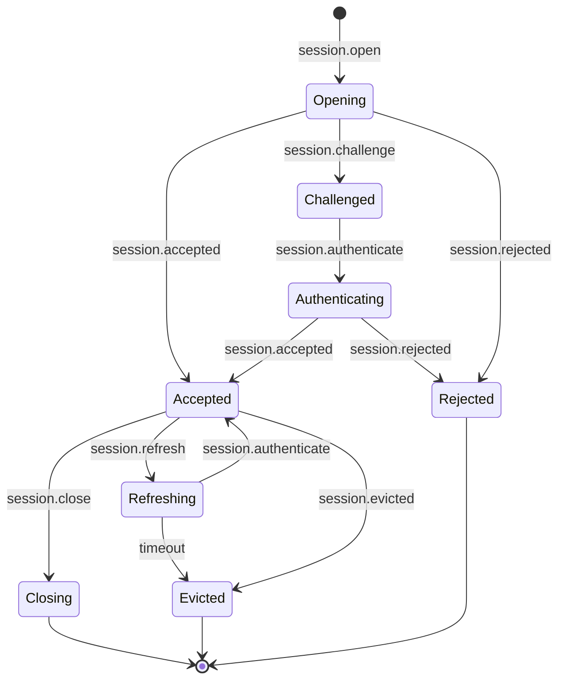
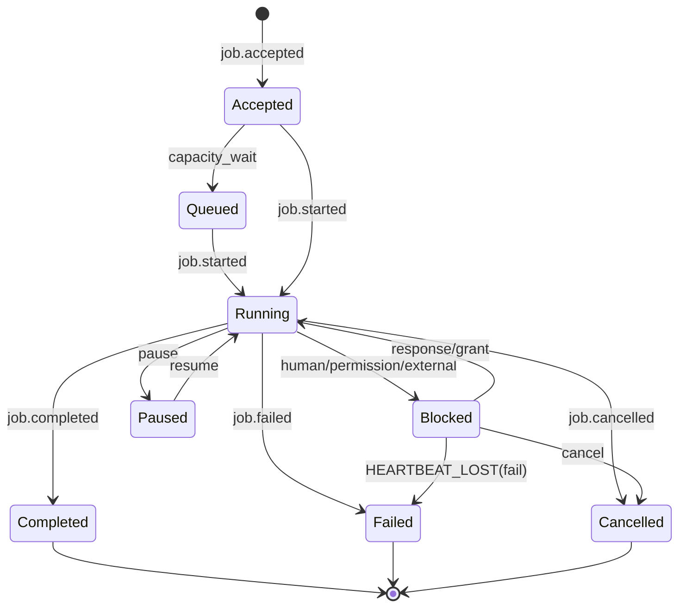
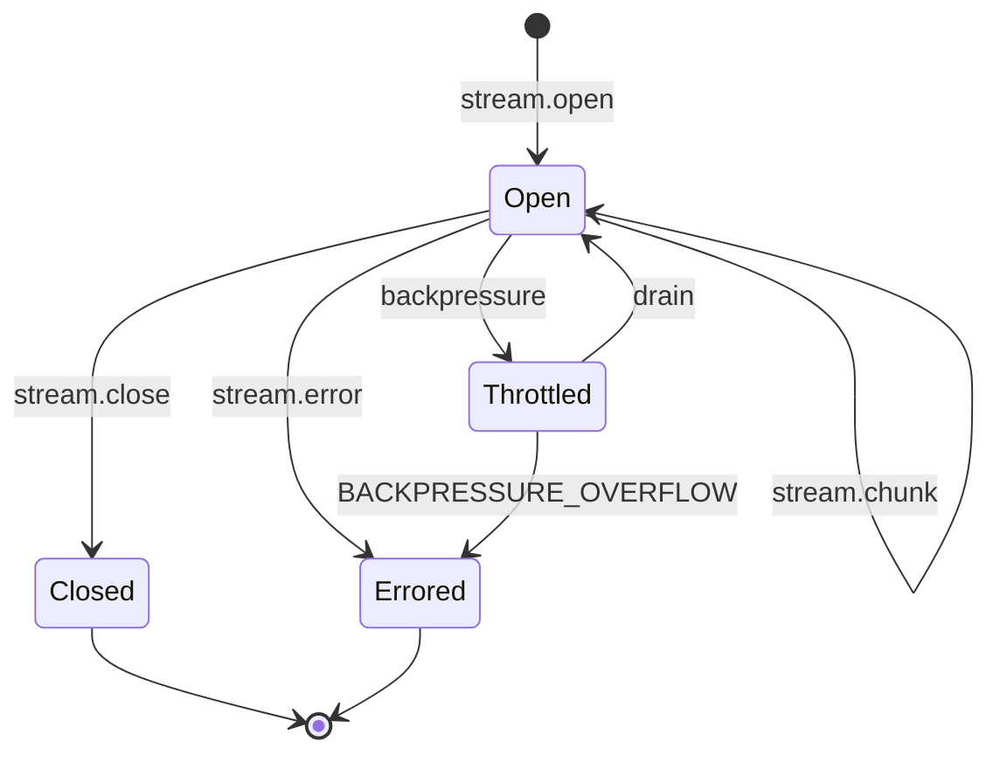
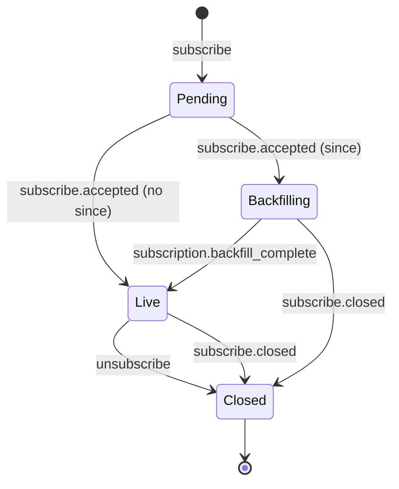
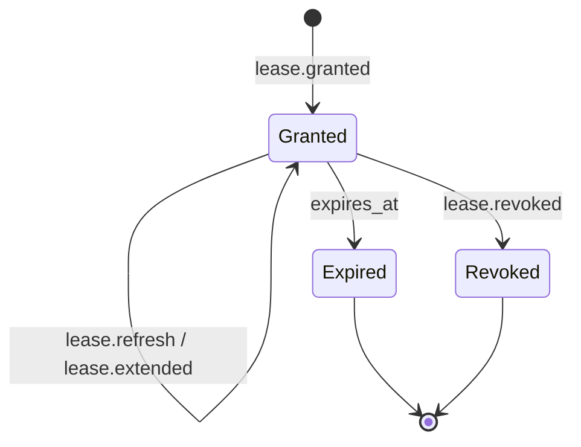

# PLAN.md — ARCP v1.0 Java 25 Reference Implementation

This document is the implementation plan for the ARCP (Agent Runtime Control Protocol) v1.0 reference SDK in Java 25, hosted at `/Users/nficano/code/arpc/java-sdk/`. The build is a multi-project Gradle layout (`:lib`, `:cli`, `:examples`) with package root `dev.arcp`, group `dev.arcp`, artifact `arcp`, JPMS modules. The plan tracks the RFC 0001 v2 spec section-by-section and binds each protocol concept to a concrete Java 25 type, package, state machine, and test.

---

## 1. Section-by-Section RFC Summary

**§1–§2 Goals / Non-Goals.** ARCP is transport-agnostic, schema-first, streaming-native, authenticated-by-default, and explicitly extensible. It does *not* define LLM prompt formats, vector DBs, tool schemas, UI rendering, auth providers, or persistence engines. The Java SDK accordingly exposes `Transport` and `CredentialValidator` as injection points, never bundling identity providers, prompt builders, or storage policies into core.

**§3 Terminology.** Sets the vocabulary used throughout the codebase. The SDK mirrors these as named records/sealed types: `Agent`, `Runtime`, `Tool`, `Session`, `Stream`, `Job`, `Capability`, `Envelope`, `Transport`, `Lease`, `Subscription`, `Artifact`, `Identity`, `Heartbeat`, `Extension`, `Observer`.

**§4 Design Principles.** §4.1 mandates support for stdio, WebSocket, HTTP/2, QUIC, Unix sockets, named pipes, MQs without semantic change — implementation provides stdio + WebSocket in v0.1 behind a `Transport` interface so the others slot in later. §4.2 establishes streaming as primitive. §4.3 forces durable jobs to support persistence, recovery, resumability, cancellation, heartbeats, scheduled wake-ups (scheduling stubbed v0.1). §4.4 typed contracts → Jackson `@JsonTypeInfo`/`@JsonSubTypes` + JSON Schema validation. §4.5 event-driven. §4.6 authenticated-by-default — `SessionManager` MUST refuse traffic before `session.accepted`. §4.7 extensions MUST be namespaced and gracefully ignored when unknown.

**§5 Architecture.** Three layers (capability, runtime, transport) and three client roles (active client, observer, peer runtime). Reflected in package layout.

**§6 Core Protocol Concepts.** §6.1 envelope: every message carries `arcp`, `id`, `type`, `timestamp`, `payload` (required); `session_id`, `job_id`, `stream_id`, `subscription_id` (conditional); `trace_id`, `span_id`, `parent_span_id` (recommended); `correlation_id`, `causation_id`, `idempotency_key`, `priority`, `extensions`, `source`, `target` (optional). §6.2 enumerates all message types. §6.3 command/result/event flow: commands MAY be acked then produce stream of events terminating in exactly one terminal event. §6.4 delivery: `id` = transport-level idempotency, `idempotency_key` = logical command idempotency keyed on `(session_principal, idempotency_key)` for ≥ lease horizon. Receivers MUST dedupe by `id`. Ordering guaranteed only within `stream_id`/`job_id`. §6.5 priority: `low|normal|high|critical`; runtime SHOULD reorder between streams but NEVER within. `critical` reserved for permission requests blocking real human action and terminal job events.

**§7 Capability Negotiation.** Every absent boolean capability MUST be treated as `false`. Required-but-unsupported features MUST yield `session.rejected` with `code: UNIMPLEMENTED`. The SDK ships a `Capabilities` record with strict default-false semantics and a `CapabilityNegotiator` that produces the intersection.

**§8 Authentication & Identity.** §8.1 four-message handshake: `session.open` → `session.challenge` (optional) → `session.authenticate` → `session.accepted | session.rejected`. Until acceptance, all non-handshake messages MUST be dropped and logged. §8.2 schemes: `bearer`, `mtls`, `oauth2`, `signed_jwt`, `none`. v0.1 implements `bearer`, `signed_jwt`, `none` (only when capability negotiated). §8.3 runtime SHOULD include identity in `session.accepted`. §8.4 mid-session re-auth via `session.refresh`. §8.5 eviction emits `session.evicted`.

**§9 Sessions.** Stateless / stateful / durable. v0.1 implements stateless and stateful. Durable resume stubbed.

**§10 Jobs.** §10.1 jobs MUST support retries, heartbeats, checkpoints, cancellation, progress. §10.2 states: `accepted | queued | running | blocked | paused | completed | failed | cancelled`. Each job MUST emit exactly one terminal state. §10.3 heartbeats every `heartbeat_interval_seconds` (default 30s); after `N=2` misses transition to `failed/HEARTBEAT_LOST` OR `blocked` per `heartbeat_recovery`. §10.4 `cancel` cooperative with `cancel.accepted`/`cancel.refused`. §10.5 `interrupt` blocks for human guidance. §10.6 scheduled jobs out of scope.

**§11 Streaming.** §11.1 kinds: `text|binary|event|log|metric|thought`. Unknown kinds → `event`. §11.2 backpressure. §11.3 binary encodings: v0.1 supports `base64` only. §11.4 `thought` streams must emit `redacted: true` markers.

**§12 Human-in-the-Loop.** §12.1 `human.input.request` with `response_schema` JSON Schema. §12.2 `human.choice.request`. §12.3 multi-channel first-valid-wins, MUST `human.input.cancelled` other channels. §12.4 expiration: `default` synthesis or `DEADLINE_EXCEEDED`.

**§13 Subscriptions.** §13.1 `subscribe` with `filter` and `since.after_message_id`. §13.2 filters AND across fields, OR within arrays; unauthorized → `PERMISSION_DENIED`. §13.3 backfill ends with `subscription.backfill_complete`. §13.4 `unsubscribe` or unilateral `subscribe.closed`.

**§14 Multi-Agent Coordination.** Out of scope v0.1.

**§15 Permissions & Security.** §15.1 explicit named permissions. §15.3 trust levels. §15.4 challenge flow: detect → `permission.request` → grant/deny. §15.5 leases: `lease.granted` → `lease.refresh` → `lease.extended`/`lease.revoked`. §15.6 trust elevation out of scope.

**§16 Artifacts.** Inline base64 only v0.1. `artifact.put`/`fetch`/`ref`/`release`. Periodic retention sweep.

**§17 Observability.** §17.1 trace propagation. §17.2 log levels `trace|debug|info|warn|error|critical`. §17.3 metrics; §17.3.1 reserved names as constants in `StandardMetrics`.

**§18 Error Model.** Required `code|message`; optional `retryable|details|cause|trace_id`. Canonical error enum. Default retryability table.

**§19 Resumability.** Resume by message id only v0.1; checkpoint resume stubbed. Retention-window expiry → `DATA_LOSS`.

**§20 MCP Compatibility.** Resources via artifacts or `kind: event` streams.

**§21 Extensions.** §21.1 namespacing `arcpx.<vendor>.<name>.v<n>`. §21.2 MUST be advertised. §21.3 unknown: nack `UNIMPLEMENTED` unless `extensions.optional: true` then drop. MUST NOT crash.

**§22 Reference Transports.** Mandatory: WebSocket + stdio.

---

## 2. Message Type → Java Record Table

| RFC type | Java record | RFC § |
|---|---|---|
| `session.open` | `dev.arcp.messages.session.SessionOpen` | §8.1, §8.2 |
| `session.challenge` | `dev.arcp.messages.session.SessionChallenge` | §8.1 |
| `session.authenticate` | `dev.arcp.messages.session.SessionAuthenticate` | §8.1 |
| `session.accepted` | `dev.arcp.messages.session.SessionAccepted` | §8.1, §8.3 |
| `session.unauthenticated` | `dev.arcp.messages.session.SessionUnauthenticated` | §8.1 |
| `session.rejected` | `dev.arcp.messages.session.SessionRejected` | §8.1 |
| `session.refresh` | `dev.arcp.messages.session.SessionRefresh` | §8.4 |
| `session.evicted` | `dev.arcp.messages.session.SessionEvicted` | §8.5 |
| `session.close` | `dev.arcp.messages.session.SessionClose` | §9 |
| `ping` / `pong` | `dev.arcp.messages.control.Ping` / `Pong` | §6.2 |
| `ack` / `nack` | `dev.arcp.messages.control.Ack` / `Nack` | §6.2, §6.3 |
| `cancel` | `dev.arcp.messages.control.Cancel` | §10.4 |
| `cancel.accepted` | `dev.arcp.messages.control.CancelAccepted` | §10.4 |
| `cancel.refused` | `dev.arcp.messages.control.CancelRefused` | §10.4 |
| `interrupt` | `dev.arcp.messages.control.Interrupt` | §10.5 |
| `resume` | `dev.arcp.messages.control.Resume` | §19 |
| `backpressure` | `dev.arcp.messages.control.Backpressure` | §11.2 |
| `checkpoint.create` / `checkpoint.restore` | `dev.arcp.messages.control.CheckpointCreate` / `CheckpointRestore` | §19 (stub) |
| `tool.invoke` | `dev.arcp.messages.execution.ToolInvoke` | §6.3 |
| `tool.result` | `dev.arcp.messages.execution.ToolResult` | §6.3 |
| `tool.error` | `dev.arcp.messages.execution.ToolError` | §18 |
| `job.accepted` | `dev.arcp.messages.execution.JobAccepted` | §10.2 |
| `job.started` | `dev.arcp.messages.execution.JobStarted` | §10.2 |
| `job.progress` | `dev.arcp.messages.execution.JobProgress` | §10.1 |
| `job.heartbeat` | `dev.arcp.messages.execution.JobHeartbeat` | §10.3 |
| `job.checkpoint` | `dev.arcp.messages.execution.JobCheckpoint` | §10.1 (stub) |
| `job.completed` | `dev.arcp.messages.execution.JobCompleted` | §10.2 |
| `job.failed` | `dev.arcp.messages.execution.JobFailed` | §10.2 |
| `job.cancelled` | `dev.arcp.messages.execution.JobCancelled` | §10.4 |
| `job.schedule` | `dev.arcp.messages.execution.JobSchedule` | §10.6 (stub) |
| `workflow.start` / `workflow.complete` | `dev.arcp.messages.execution.WorkflowStart` / `WorkflowComplete` | §6.3 (stub) |
| `agent.delegate` / `agent.handoff` | `dev.arcp.messages.execution.AgentDelegate` / `AgentHandoff` | §14 (stub) |
| `stream.open` | `dev.arcp.messages.streaming.StreamOpen` | §11.1 |
| `stream.chunk` | `dev.arcp.messages.streaming.StreamChunk` | §11 |
| `stream.close` | `dev.arcp.messages.streaming.StreamClose` | §11 |
| `stream.error` | `dev.arcp.messages.streaming.StreamError` | §10.4, §18 |
| `human.input.request` | `dev.arcp.messages.human.HumanInputRequest` | §12.1 |
| `human.input.response` | `dev.arcp.messages.human.HumanInputResponse` | §12.1 |
| `human.choice.request` | `dev.arcp.messages.human.HumanChoiceRequest` | §12.2 |
| `human.choice.response` | `dev.arcp.messages.human.HumanChoiceResponse` | §12.2 |
| `human.input.cancelled` | `dev.arcp.messages.human.HumanInputCancelled` | §12.3, §12.4 |
| `permission.request` | `dev.arcp.messages.permissions.PermissionRequest` | §15.4 |
| `permission.grant` | `dev.arcp.messages.permissions.PermissionGrant` | §15.4 |
| `permission.deny` | `dev.arcp.messages.permissions.PermissionDeny` | §15.4 |
| `lease.granted` | `dev.arcp.messages.permissions.LeaseGranted` | §15.5 |
| `lease.extended` | `dev.arcp.messages.permissions.LeaseExtended` | §15.5 |
| `lease.revoked` | `dev.arcp.messages.permissions.LeaseRevoked` | §15.5 |
| `lease.refresh` | `dev.arcp.messages.permissions.LeaseRefresh` | §15.5 |
| `subscribe` | `dev.arcp.messages.subscriptions.Subscribe` | §13.1 |
| `subscribe.accepted` | `dev.arcp.messages.subscriptions.SubscribeAccepted` | §13.1 |
| `subscribe.event` | `dev.arcp.messages.subscriptions.SubscribeEvent` | §13.1 |
| `unsubscribe` | `dev.arcp.messages.subscriptions.Unsubscribe` | §13.4 |
| `subscribe.closed` | `dev.arcp.messages.subscriptions.SubscribeClosed` | §13.4 |
| `artifact.put` | `dev.arcp.messages.artifacts.ArtifactPut` | §16.2 |
| `artifact.fetch` | `dev.arcp.messages.artifacts.ArtifactFetch` | §16.2 |
| `artifact.ref` | `dev.arcp.messages.artifacts.ArtifactRef` | §16.1 |
| `artifact.release` | `dev.arcp.messages.artifacts.ArtifactRelease` | §16.2 |
| `event.emit` | `dev.arcp.messages.telemetry.EventEmit` | §13.3, §6.2 |
| `log` | `dev.arcp.messages.telemetry.Log` | §17.2 |
| `metric` | `dev.arcp.messages.telemetry.Metric` | §17.3 |
| `trace.span` | `dev.arcp.messages.telemetry.TraceSpan` | §17.1 |

All payload records implement a sealed interface `MessageType`. The envelope record `dev.arcp.envelope.Envelope` carries every §6.1 field; Jackson polymorphism uses `@JsonTypeInfo(use = NAME, property = "type")` plus `@JsonSubTypes(...)` on the sealed interface.

---

## 3. State Machines

### 3.1 Sessions (§8, §9)

Governed by §8.1 (handshake), §8.4 (refresh), §8.5 (eviction), §9 (close). Until `Accepted`, inbound dispatcher MUST drop and log non-handshake messages.

### 3.2 Jobs (§10.2)

Governed by §10.2; heartbeat-loss path §10.3; cancellation §10.4; interrupt §10.5. Exactly one terminal event per job enforced by `JobStateMachine.transition(...)`.

### 3.3 Streams (§11)

Order preserved within `stream_id` per §6.5.

### 3.4 Subscriptions (§13)

### 3.5 Leases (§15.5)

Operations against Expired/Revoked → `LEASE_EXPIRED`/`LEASE_REVOKED`.

---

## 4. Open Questions / RFC Ambiguities

1. **§6.1 `arcp` field semantics.** Receiver behavior on mismatch undefined. *Interpretation:* accept `1.x`, reject `2.x+` with `session.rejected/UNIMPLEMENTED`.
2. **§6.4 idempotency persistence horizon.** Commands without leases have no horizon. *Interpretation:* default 24h sliding window keyed `(principal, idempotency_key)`.
3. **§6.5 fairness floors.** Not defined. *Interpretation:* weighted round-robin, min 10% slots for lower-than-critical.
4. **§7 unknown extension namespaces.** Not addressed. *Interpretation:* advisory; messages follow §21.3.
5. **§8.2 `none` scheme capability.** Whether `capabilities.anonymous` is core. *Interpretation:* treat as core key.
6. **§10.3 heartbeat sequence reset on resume.** Unspecified. *Interpretation:* monotonic across `job_id` lifetime.
7. **§10.4 cancel of cancel.** Silent. *Interpretation:* idempotent; second cancel → `cancel.refused/already_terminal`.
8. **§11.1 unknown stream kinds.** "SHOULD be treated as event" but content/encoding undefined. *Interpretation:* opaque JSON.
9. **§11.4 thought redaction policy source.** Unspecified. *Interpretation:* `ThoughtRedactor` SPI; default no-op.
10. **§12.1 JSON Schema draft.** Unspecified. *Interpretation:* JSON Schema 2020-12 via `networknt`.
11. **§12.4 `default` `responded_at` source.** Unstated. *Interpretation:* `Clock.now()` at synthesis.
12. **§13.2 filter combinatorial limits.** Unbounded. *Interpretation:* cap at 1024 array entries.
13. **§13.3 backfill ordering.** Unclear. *Interpretation:* monotonic ULID.
14. **§15.5 lease.refresh refusal type.** Not defined. *Interpretation:* `nack` with `PERMISSION_DENIED`.
15. **§16.3 retention sweep cadence.** Not specified. *Interpretation:* `min(default_seconds/4, 60s)`.
16. **§17.3 metric dim cardinality.** Uncapped. *Interpretation:* warn above 20, don't reject.
17. **§18.1 `cause` recursive shape.** Unstated. *Interpretation:* same error envelope, capped depth 5.
18. **§19 retention window default.** Unspecified. *Interpretation:* 7 days.
19. **§21.3 `extensions.optional` location.** Unclear. *Interpretation:* sibling on envelope's `extensions` object.
20. **§22 stdio framing.** Undefined. *Interpretation:* NDJSON, `\n` terminator, UTF-8.

---

## 5. Test Plan

All tests live under `lib/src/test/java`. Organized by phase.

**Phase 1 — Envelope & Serialization**
- `T0101_envelope_roundtrip_all_fields` (§6.1)
- `T0102_unknown_type_drops_with_nack` (§21.3)
- `T0103_duplicate_id_dedupes` (§6.4)
- `T0104_idempotency_key_returns_prior_outcome` (§6.4)
- `T0105_priority_critical_not_reordered_within_stream` (§6.5)

**Phase 2 — Auth & Sessions**
- `T0201_bearer_handshake_happy_path` (§8.1, §8.2)
- `T0202_signed_jwt_handshake_happy_path` (§8.2)
- `T0203_pre_accept_message_dropped_and_logged` (§8.1)
- `T0204_none_refused_without_anonymous_capability` (§8.2)
- `T0205_session_refresh_flow_extends_session` (§8.4)
- `T0206_eviction_emits_canonical_reason` (§8.5)
- `T0207_session_close_cancels_inflight_jobs` (§9)
- `T0208_absent_capability_treated_as_false` (§7)
- `T0209_required_unsupported_yields_session_rejected_unimplemented` (§7)

**Phase 3 — Jobs & Streams**
- `T0301_job_full_lifecycle` (§10.2)
- `T0302_one_terminal_event_only` (§10.2)
- `T0303_heartbeat_emitted_within_interval` (§10.3)
- `T0304_heartbeat_lost_fail_mode` (§10.3)
- `T0305_heartbeat_lost_block_mode` (§10.3)
- `T0306_cancel_cooperative_within_deadline` (§10.4)
- `T0307_cancel_deadline_escalates_to_aborted` (§10.4)
- `T0308_cancel_already_terminal_refused` (§10.4)
- `T0309_interrupt_blocks_emits_human_input_request` (§10.5)
- `T0310_stream_open_chunk_close_text` (§11.1)
- `T0311_unknown_kind_treated_as_event` (§11.1)
- `T0312_backpressure_throttles_sender` (§11.2)
- `T0313_binary_base64_with_sha256` (§11.3)
- `T0314_thought_redacted_chunk_preserves_marker` (§11.4)

**Phase 4 — Human-in-loop, Permissions, Leases**
- `T0401_input_request_validates_response_schema` (§12.1)
- `T0402_invalid_response_returns_invalid_argument` (§12.1)
- `T0403_choice_request_resolves_first_response` (§12.2)
- `T0404_default_synthesis_on_expiry` (§12.4)
- `T0405_no_default_emits_human_input_cancelled_deadline_exceeded` (§12.4)
- `T0406_secondary_channel_receives_human_input_cancelled` (§12.3)
- `T0407_permission_challenge_blocks_then_grants` (§15.4)
- `T0408_lease_granted_extended_revoked_lifecycle` (§15.5)
- `T0409_expired_lease_yields_LEASE_EXPIRED` (§15.5)
- `T0410_revoked_lease_yields_LEASE_REVOKED` (§15.5)
- `T0411_permission_deny_fails_job_PERMISSION_DENIED` (§15.4)

**Phase 5 — Subscriptions, Artifacts, Resume**
- `T0501_subscribe_filter_session_and_types` (§13.1, §13.2)
- `T0502_unauthorized_filter_denied` (§13.2)
- `T0503_backfill_emits_subscription_backfill_complete` (§13.3)
- `T0504_unsubscribe_clean_close` (§13.4)
- `T0505_subscribe_closed_overflow_BACKPRESSURE_OVERFLOW` (§13.4, §18)
- `T0506_artifact_put_fetch_inline_base64_roundtrip` (§16.2)
- `T0507_artifact_ref_in_tool_result` (§16.1)
- `T0508_artifact_release_then_fetch_NOT_FOUND` (§16.2)
- `T0509_retention_sweep_removes_expired` (§16.3)
- `T0510_resume_after_message_id_replays_canonical_stream` (§19)
- `T0511_resume_past_retention_DATA_LOSS` (§19)

**Phase 6 — Transports**
- `T0601_websocket_transport_full_handshake` (§22)
- `T0602_stdio_ndjson_transport_full_handshake` (§22)
- `T0603_transport_preserves_body_bytewise` (§22)
- Integration suite re-runs parameterized against both transports.

**Phase 7 — E2E**
- `RelayScenarioTest` — runtime + agent + observer; tool invoke + human input + artifact + completion against both transports.

---

## 6. Java-Specific Design Choices

**Sealed `MessageType` + Jackson polymorphism.** All payload records implement `sealed interface MessageType permits …`. Jackson uses `@JsonTypeInfo(use = NAME, property = "type")` + `@JsonSubTypes` on the sealed interface. `switch` expressions over `MessageType` are compile-time exhaustive.

**Virtual threads + `StructuredTaskScope`.** Each session owns a virtual-thread executor; each job runs inside a `StructuredTaskScope` so §10.4 cancellation cascades automatically. Heartbeat emitters are virtual threads parked on `Thread.sleep`.

**`ScopedValue<TraceContext>` instead of `ThreadLocal`.** Trace context is bound at message dispatch via `ScopedValue.where(Tracing.TRACE, ctx).run(...)`. Virtual-thread-friendly, immutable.

**JSpecify + NullAway.** Packages are `@NullMarked`; nullable returns/params are explicit `@Nullable`. NullAway runs with `-Werror`.

**Bounded `LinkedBlockingQueue` for backpressure.** Each stream owns a bounded queue (default 1024). 75% fill → emit `backpressure`; overflow → `BACKPRESSURE_OVERFLOW`.

**`Flow.Publisher<Envelope>` for subscriptions.** JDK-native demand signaling without Reactor/RxJava.

**Injected `Clock`.** All time-dependent components take a `java.time.Clock`; tests inject `Clock.fixed(...)`.

**ULIDs for ids.** All ids use `f4b6a3:ulid-creator` ULIDs — lexicographic = chronological.

**Multi-project Gradle.** `:lib` (published), `:cli` (`arcp` binary via picocli), `:examples` (runnable).

**JPMS `module-info.java`.** `arcp` module exports public packages; opens `dev.arcp.messages.*` and `dev.arcp.envelope` to `com.fasterxml.jackson.databind` for reflective deserialization. Internal packages (`store`, `util`, internal runtime helpers) stay unexported.

---

## 7. Scope Statement

### IN-SCOPE for v0.1

- §6.1 envelope (full set).
- §8 auth: `bearer`, `signed_jwt`, `none`.
- §7 capability negotiation.
- §9 stateless + stateful sessions.
- §10 jobs: full state machine, heartbeats (both recovery modes), cancellation, interrupts.
- §11 streams: `text|event|log|thought`; backpressure; base64 binary only.
- §12 human-in-loop with default fallback.
- §13 subscriptions with filters and backfill.
- §15 permissions: challenge + lease lifecycle.
- §16 artifacts: inline base64.
- §17 observability: log/metric/trace.span; SLF4J + ScopedValue.
- §18 canonical error enum.
- §19 message-id resume only.
- §21 extensions registry.
- §22 WebSocket + stdio.
- SQLite event log.

### OUT-OF-SCOPE for v0.1 (stub with `UnimplementedException("§X.Y …")`)

- HTTP/2 + QUIC transports
- mTLS + OAuth2 schemes
- sidecar binary frames
- §10.6 scheduled jobs
- §14 multi-agent delegation
- workflow primitives
- §15.6 trust elevation
- §19 checkpoint resume
- artifact GC beyond periodic sweep
- §12.3 quorum response policy
- Android targets
- GraalVM native-image

---

## 8. Dependency Justification

- **`jackson-databind`** — record-aware JSON + `@JsonTypeInfo`/`@JsonSubTypes` polymorphism.
- **`jackson-datatype-jsr310`** — `Instant` for §6.1 `timestamp`, leases, expirations.
- **`sqlite-jdbc`** — embeddable event log for §6.4 idempotency + §19 resume.
- **`Java-WebSocket`** — pure-Java WS for §22 without Netty.
- **`nimbus-jose-jwt`** — JWS/JWT for §8.2 `signed_jwt`.
- **`slf4j-api`** — logging facade for §17.2.
- **`jspecify`** — null annotations consumed by NullAway.
- **`picocli`** — CLI framework for `:cli`.
- **`json-schema-validator`** — JSON Schema 2020-12 for §12.1 `response_schema`.
- **`ulid-creator`** — ULID generation for all ids.
