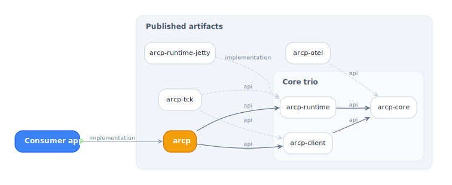
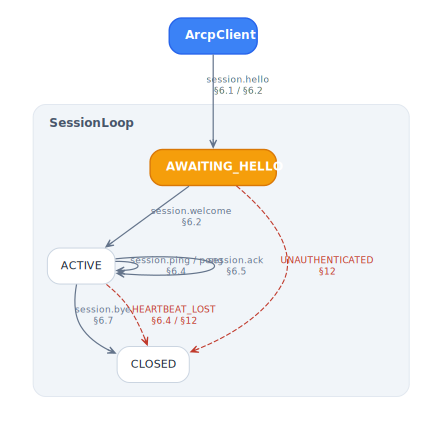

<picture>
  <source media="(prefers-color-scheme: dark)"  srcset="diagrams/module-graph-dark.svg">
  <source media="(prefers-color-scheme: light)" srcset="diagrams/module-graph-light.svg">
  
</picture>

# ARCP Java SDK

The **Agent Runtime Control Protocol (ARCP)** is a JSON-over-WebSocket protocol
that lets a client submit jobs to a runtime, observe their events, enforce
per-job leases (filesystem, network, tool, model, budget), and reattach to work
after a disconnect. The full spec lives at
[`../spec/docs/draft-arcp-1.1.md`](../../spec/docs/draft-arcp-1.1.md).

This SDK is a JDK 21+ reference implementation. It ships ten published Maven
artifacts, twenty-four runnable examples and recipes, and a reusable
conformance suite (`arcp-tck`) that downstream JVM implementations can extend.

## Start here

| Document | What it covers |
|---|---|
| [Getting started](getting-started.md) | Prerequisites, Gradle/Maven install, 60-line in-process example, WebSocket swap, bearer auth |
| [Architecture](architecture.md) | Envelope shape, sessions, jobs, leases, errors, wire taxonomy |
| [Transports](transports.md) | `MemoryTransport`, `WebSocketTransport`, Jetty server, Spring Boot, Jakarta, Vert.x, stdio |
| [Conformance](conformance.md) | Spec §-keyed implementation status table |
| [Troubleshooting](troubleshooting.md) | Common error codes, causes, and fixes |
| [Recipes](recipes.md) | Copy-paste solutions for idempotent retry, streaming, delegation, OTel |

## Guides

| Guide | Spec §§ |
|---|---|
| [Sessions](guides/sessions.md) | §6 — handshake, capability negotiation, heartbeats, ack, resume |
| [Authentication](guides/auth.md) | §6.1 — bearer tokens, `BearerVerifier` SPI, custom verifiers |
| [Resume](guides/resume.md) | §6.3 — resume tokens, `ResumeBuffer`, reconnect flow |
| [Jobs](guides/jobs.md) | §7 — submit, idempotency, cancel, timeouts, list, subscribe, cost budgets, agent versions |
| [Job events](guides/job-events.md) | §8 — event kinds, progress, result streaming, vendor extensions |
| [Leases](guides/leases.md) | §9 — namespaces, glob matching, expiration, model use |
| [Delegation](guides/delegation.md) | §10 — sub-agent jobs, lease subset enforcement |
| [Errors](guides/errors.md) | §12 — all 15 error codes, retryability, retry helper pattern |
| [Observability](guides/observability.md) | §11 — OpenTelemetry span-per-envelope, trace propagation |
| [Vendor extensions](guides/vendor-extensions.md) | §8.5 — `extensions` payload field, custom event kinds |
| [Credentials](guides/credentials.md) | §9.8 / §14 — `CredentialProvisioner` SPI, lifecycle, confidentiality |

## Modules

| Module | Purpose |
|---|---|
| [`arcp`](modules/arcp.md) | Umbrella artifact: re-exports `arcp-client` + `arcp-runtime` |
| [`arcp-core`](modules/arcp-core.md) | Wire types, envelope, ids, lease, sealed message/event taxonomies, errors, Transport SPI |
| [`arcp-client`](modules/arcp-client.md) | `ArcpClient`, `JobHandle`, `ResultStream`, `WebSocketTransport` |
| [`arcp-runtime`](modules/arcp-runtime.md) | `ArcpRuntime`, session FSM, job FSM, `LeaseGuard`, `BudgetCounters`, resume buffer |
| [`arcp-runtime-jetty`](modules/arcp-runtime-jetty.md) | Embedded Jetty 12 WebSocket server |
| [`arcp-middleware-jakarta`](modules/arcp-middleware-jakarta.md) | Jakarta WebSocket `ServerEndpointConfig` adapter |
| [`arcp-middleware-spring-boot`](modules/arcp-middleware-spring-boot.md) | Spring Boot 3.x auto-configuration |
| [`arcp-middleware-vertx`](modules/arcp-middleware-vertx.md) | Vert.x 5 `Handler<ServerWebSocket>` |
| [`arcp-otel`](modules/arcp-otel.md) | OpenTelemetry transport wrapper |
| [`arcp-tck`](modules/arcp-tck.md) | Reusable JUnit 5 conformance suite |

## Reference

- [Wire format](https://github.com/agentruntimecontrolprotocol/java-sdk/blob/main/arcp-core/src/main/java/dev/arcp/core/wire/Envelope.java) — `Envelope`, 17 message types, 10 event kinds, `ArcpMapper` config
- [Error codes](guides/errors.md) — 15 canonical codes, sealed `ArcpException` hierarchy
- [CONFORMANCE.md](../CONFORMANCE.md) — spec §-keyed implementation status with file:line references
- [CHANGELOG.md](../CHANGELOG.md) — release history
- [Examples](../examples/) — runnable subprojects covering every feature

## Diagrams

Six Graphviz diagrams under [`diagrams/`](diagrams/) with light and dark variants.
Regenerate with `make -C docs/diagrams`.

<table>
<tr>
<td>

<picture>
  <source media="(prefers-color-scheme: dark)"  srcset="diagrams/session-lifecycle-dark.svg">
  <source media="(prefers-color-scheme: light)" srcset="diagrams/session-lifecycle-light.svg">
  
</picture>

</td>
<td>

<picture>
  <source media="(prefers-color-scheme: dark)"  srcset="diagrams/job-lifecycle-dark.svg">
  <source media="(prefers-color-scheme: light)" srcset="diagrams/job-lifecycle-light.svg">
  
</picture>

</td>
</tr>
</table>
