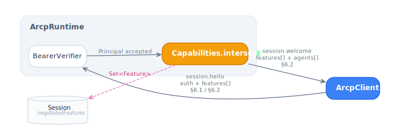
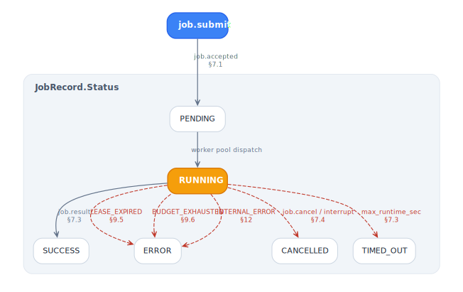

# Architecture

## Envelope (§5.1)

Every wire message rides in one JSON envelope:

| Field | Java type | Required | Notes |
|---|---|---|---|
| `arcp` | `String` | yes | `Envelope.VERSION = "1.1"` |
| `id` | [`MessageId`](../arcp-core/src/main/java/dev/arcp/core/ids/MessageId.java) | yes | ULID, monotonic per process |
| `type` | discriminator → [`Message.Type`](../arcp-core/src/main/java/dev/arcp/core/messages/Message.java) | yes | |
| `payload` | `JsonNode`, decoded per `type` | yes | |
| `session_id` | [`SessionId`](../arcp-core/src/main/java/dev/arcp/core/ids/SessionId.java) | absent on `session.hello`, required after | |
| `trace_id` | [`TraceId`](../arcp-core/src/main/java/dev/arcp/core/ids/TraceId.java) | optional | propagated end-to-end for §11 |
| `job_id` | [`JobId`](../arcp-core/src/main/java/dev/arcp/core/ids/JobId.java) | required on job-scoped messages | |
| `event_seq` | `Long` | required on `job.event` | monotonic, gap-free per session |

Unknown top-level fields are dropped on parse — Jackson
[`ArcpMapper`](../arcp-core/src/main/java/dev/arcp/core/wire/ArcpMapper.java)
sets `FAIL_ON_UNKNOWN_PROPERTIES=false` for forward compatibility.

## Message taxonomy

Seventeen wire types, all members of the sealed
[`Message`](../arcp-core/src/main/java/dev/arcp/core/messages/Message.java)
interface. Dispatch is exhaustive at compile time.

| `type` | Java record | Direction |
|---|---|---|
| `session.hello` | `SessionHello` | client → runtime |
| `session.welcome` | `SessionWelcome` | runtime → client |
| `session.bye` | `SessionBye` | either |
| `session.ping` | `SessionPing` | runtime → client |
| `session.pong` | `SessionPong` | client → runtime |
| `session.ack` | `SessionAck` | client → runtime |
| `session.list_jobs` | `SessionListJobs` | client → runtime |
| `session.jobs` | `SessionJobs` | runtime → client |
| `job.submit` | `JobSubmit` | client → runtime |
| `job.accepted` | `JobAccepted` | runtime → client |
| `job.event` | `JobEvent` | runtime → client |
| `job.result` | `JobResult` | runtime → client |
| `job.error` | `JobError` | runtime → client |
| `job.cancel` | `JobCancel` | client → runtime |
| `job.subscribe` | `JobSubscribe` | client → runtime |
| `job.subscribed` | `JobSubscribed` | runtime → client |
| `job.unsubscribe` | `JobUnsubscribe` | client → runtime |

## Event-body taxonomy

Ten event kinds, sealed under
[`EventBody`](../arcp-core/src/main/java/dev/arcp/core/events/EventBody.java).

| `kind` | Java record | Notes |
|---|---|---|
| `log` | `LogEvent` | structured log line from agent |
| `thought` | `ThoughtEvent` | agent reasoning step |
| `tool_call` | `ToolCallEvent` | outbound tool invocation |
| `tool_result` | `ToolResultEvent` | inbound tool response |
| `status` | `StatusEvent` | lifecycle phase change |
| `metric` | `MetricEvent` | numeric measurement, drives `cost.budget` |
| `artifact_ref` | `ArtifactRefEvent` | reference to a produced artifact |
| `delegate` | `DelegateEvent` | sub-agent job dispatch record |
| `progress` | `ProgressEvent` | current / total progress tuple |
| `result_chunk` | `ResultChunkEvent` | one piece of a chunked final result |

## Sessions (§6)

A session is one transport connection with one negotiated feature set.

### Handshake

1. Client sends `session.hello` carrying `auth` (bearer token) and a `features`
   list of capability strings.
2. Runtime verifies auth, intersects feature lists
   ([`Capabilities.intersect`](../arcp-core/src/main/java/dev/arcp/core/capabilities/Capabilities.java)),
   and replies with `session.welcome` carrying the intersection plus a fresh
   `resume_token`.
3. Both peers MUST NOT use any feature outside the negotiated intersection.

<picture>
  <source media="(prefers-color-scheme: dark)"  srcset="diagrams/capability-negotiation-dark.svg">
  <source media="(prefers-color-scheme: light)" srcset="diagrams/capability-negotiation-light.svg">
  
</picture>

### Heartbeats (§6.4)

When both peers negotiate `heartbeat`, the runtime schedules a `session.ping`
after each idle interval. The client replies with `session.pong`. Two missed
intervals on either side surface `HEARTBEAT_LOST` (retryable — resume the
session). See [guides/sessions.md](guides/sessions.md#heartbeats) for details.

### Ack (§6.5)

A client with `ack` negotiated emits `session.ack { last_processed_seq }`
periodically so the runtime can free buffered events earlier. Advisory, not
flow-controlling. See [guides/sessions.md](guides/sessions.md#ack).

### Resume (§6.3)

A fresh `session.hello` carrying `resume_token` and `last_event_seq` from a
prior session replays buffered events from the in-memory
[`ResumeBuffer`](../arcp-runtime/src/main/java/dev/arcp/runtime/session/ResumeBuffer.java).
See [guides/resume.md](guides/resume.md).

## Jobs (§7)

A job is one agent invocation. State machine:

```
PENDING → RUNNING → { SUCCESS | ERROR | CANCELLED | TIMED_OUT }
```

<picture>
  <source media="(prefers-color-scheme: dark)"  srcset="diagrams/job-lifecycle-dark.svg">
  <source media="(prefers-color-scheme: light)" srcset="diagrams/job-lifecycle-light.svg">
  
</picture>

- **Submit**: `client.submit(jobSubmit)` blocks until `job.accepted` returns
  with the resolved `agent@version`, effective lease, and initial budget.
- **Events**: `handle.events()` is a buffered `Flow.Publisher<EventBody>`. Late
  subscribers see the full history (replaying publisher).
- **Result**: `handle.result()` is a `CompletableFuture<JobResult>` that
  completes on `job.result` or fails with the matching `ArcpException` on
  `job.error`.
- **Cancel**: `handle.cancel()` sends `job.cancel`; the runtime interrupts the
  worker virtual thread. Agents check `ctx.cancelled()` cooperatively.

Terminal states are sticky — competing transitions lose to the first writer via
CAS on
[`JobRecord.Status`](../arcp-runtime/src/main/java/dev/arcp/runtime/session/JobRecord.java).

## Leases (§9)

A `Lease` is a bag of namespace → glob-pattern lists. Reserved namespaces:

| Namespace | Meaning | Spec |
|---|---|---|
| `fs.read` | Filesystem path globs for reading | §9.2 |
| `fs.write` | Filesystem path globs for writing | §9.2 |
| `net.fetch` | Outbound URL globs | §9.2 |
| `tool.call` | Tool-name globs | §9.2 |
| `agent.delegate` | Sub-agent name globs | §9.2 |
| `cost.budget` | `currency:decimal` upper bounds | §9.6 |
| `model.use` | Model-ID globs (v1.1) | §9.7 |

Agents authorize per-operation via `ctx.authorize(namespace, pattern)`. The
[`LeaseGuard`](../arcp-runtime/src/main/java/dev/arcp/runtime/lease/LeaseGuard.java)
matches globs (`*` = any chars except `/`, `**` = any chars including `/`),
checks `expires_at` if set, and throws `PermissionDeniedException` on miss.

See [guides/leases.md](guides/leases.md) for full details.

## Agent versioning (§7.5)

The `agent` field in `job.submit` accepts `name` or `name@version`. The
runtime advertises available versions in `session.welcome`. A bare name
resolves to the registered default; `name@version` requires an exact match.

```java
ArcpRuntime runtime = ArcpRuntime.builder()
    .agent("code-refactor", "1.0.0", v1)
    .agent("code-refactor", "2.0.0", v2)
    .build();
runtime.agents().setDefault("code-refactor", "2.0.0");
```

Grammar: [`AgentRef.parse`](../arcp-core/src/main/java/dev/arcp/core/agents/AgentRef.java);
resolution: [`AgentRegistry.resolve`](../arcp-runtime/src/main/java/dev/arcp/runtime/agent/AgentRegistry.java).

## Errors (§12)

Fifteen canonical
[`ErrorCode`](../arcp-core/src/main/java/dev/arcp/core/error/ErrorCode.java)
values. The sealed
[`ArcpException`](../arcp-core/src/main/java/dev/arcp/core/error/ArcpException.java)
hierarchy splits at `RetryableArcpException` / `NonRetryableArcpException` —
a generic retry loop cannot accidentally retry `LEASE_EXPIRED` or
`BUDGET_EXHAUSTED`.

| Code | Retryable | Java exception |
|---|---|---|
| `PERMISSION_DENIED` | no | `PermissionDeniedException` |
| `LEASE_SUBSET_VIOLATION` | no | `LeaseSubsetViolationException` |
| `JOB_NOT_FOUND` | no | `JobNotFoundException` |
| `DUPLICATE_KEY` | no | `DuplicateKeyException` |
| `AGENT_NOT_AVAILABLE` | no | `AgentNotAvailableException` |
| `AGENT_VERSION_NOT_AVAILABLE` | no | `AgentVersionNotAvailableException` |
| `CANCELLED` | no | `CancelledException` |
| `TIMEOUT` | yes | `TimeoutException` |
| `RESUME_WINDOW_EXPIRED` | no | `ResumeWindowExpiredException` |
| `HEARTBEAT_LOST` | yes | `HeartbeatLostException` |
| `LEASE_EXPIRED` | no | `LeaseExpiredException` |
| `BUDGET_EXHAUSTED` | no | `BudgetExhaustedException` |
| `INVALID_REQUEST` | no | `InvalidRequestException` |
| `UNAUTHENTICATED` | no | `UnauthenticatedException` |
| `INTERNAL_ERROR` | yes | `InternalErrorException` |

See [guides/errors.md](guides/errors.md) for the full table plus a retry helper
pattern.

## Threading model

- **Virtual threads** (JEP 444, stable JDK 21) drive every per-job worker and
  every transport publisher dispatch.
- **One `ScheduledExecutorService`** per runtime fires heartbeat ticks and
  lease-expiry watchdogs (platform threads for the scheduler, virtual-thread
  runnables for the callbacks — the JDK does not provide a virtual-thread
  `ScheduledExecutorService`).
- **`StructuredTaskScope`** is intentionally absent from published bytecode: it
  is preview in JDK 21 and finalised with a different shape in JDK 25; the SDK
  targets `--release 21`.

## Jackson configuration

[`ArcpMapper.create()`](../arcp-core/src/main/java/dev/arcp/core/wire/ArcpMapper.java):

| Setting | Reason |
|---|---|
| `registerModule(new JavaTimeModule())` | `Instant` for §9.5 `expires_at` |
| `enable(USE_BIG_DECIMAL_FOR_FLOATS)` | §9.6 budget arithmetic — no double-precision drift |
| `disable(FAIL_ON_UNKNOWN_PROPERTIES)` | forward-compatible envelope |
| `disable(WRITE_DATES_AS_TIMESTAMPS)` | ISO-8601 on the wire |
| `setSerializationInclusion(NON_NULL)` | omit null fields globally |

Override per runtime or per client via `ArcpRuntime.Builder.mapper(ObjectMapper)`
and `ArcpClient.Builder.mapper(ObjectMapper)`.
